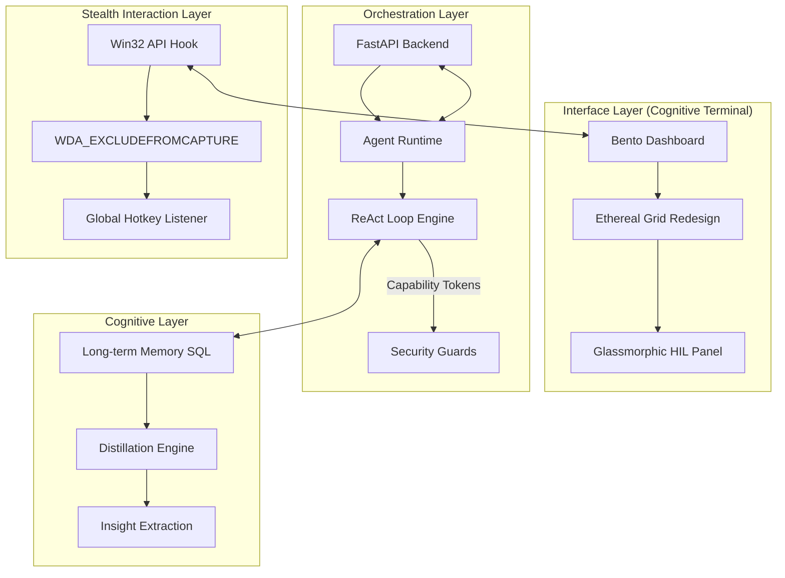

# 👻 Stuart — The AI They Can't See, Can't Detect, Can't Stop

**An invisible AI overlay that lives on your screen — answers questions, solves problems, analyzes screenshots, and feeds you real-time intelligence. Works during interviews, exams, meetings, or anything on your screen. Invisible to screen recordings. Undetectable by proctoring software. You see everything. They see nothing.**


> **👻 Invisible by Design** — Screen capture protected. Hidden from taskbar. Undetectable by Zoom, Teams, Google Meet, and every proctoring tool on the market.

> **💸 $0. Forever.** — No subscriptions. No credits. No paywalls. Bring your own free API keys and **own** it.

> **⚡ Stupidly Fast** — Powered by **Cerebras** (~2,000-3,000 tokens/sec) and **Groq** (~400-700 tokens/sec) — the two fastest AI inference engines on Earth. Answers hit your screen before the interviewer finishes talking. Nothing else comes close.

---

## ✨ What is Stuart?

Stuart isn't just another interview prep tool. It's your secret weapon for **any challenge**—from aptitude tests to quantitative brain-twisters, behavioral showdowns to certification exams. Stuart is a **revolutionary AI assistant** that operates in real-time, providing candidates with the critical insights they need to excel in high-stakes situations—all without ever tripping tab-switching warnings, thanks to its stealthy, seamless design.

Imagine having a world-class expert whispering in your ear, helping you deconstruct complex problems, articulate your thoughts, and navigate the toughest questions with confidence. **That's Stuart.**

### How It Works

Stuart sits on top of your screen as an **invisible overlay** during live interviews and exams. It **listens** to conversations in real-time via Deepgram speech-to-text, **generates** intelligent coaching responses using blazing-fast LLMs (Groq, Cerebras, Gemini), and lets you **screenshot** any problem for instant Vision AI solutions—all while staying **completely hidden** from screen recordings, proctoring software, and human observers.

---

## 🔥 Stuart in the Hot Seat: Crush Every Round

### The Scene: Your Make-or-Break Moment

Clock's ticking. Stakes are high. Stuart's got you covered—whether it's an interview or an exam. Its **Stealth Mode** ensures you can access its powerful features without raising any red flags, keeping your focus entirely on the task at hand.

---

### **Round 1: Behavioral Mastery** 🧠

**The Curveball**: *"Tell me about a time you turned failure into success."*

- **Without Stuart**: Stammering, scrambling, stuck.
- **With Stuart (Stealth Mode active)**:
  - Real-time transcription catches every word, discreetly.
  - **STAR-method gold** pops up on your screen, invisible to others—customized to your resume and role.
  - You drop a story so smooth, they're taking notes.

*Boom: You're unforgettable.*

---

### **Round 2: Quantitative Crusher** 📊

**The Brainteaser**: *"Calculate the probability of 7 consecutive heads in all three coins tossed at same time in 100 coin tosses."*

- **With Stuart (Stealth Mode is your superpower here)**:
  1. `Alt+Shift+S` → **Proctoring Stealth Mode** activates. Stuart becomes a transparent, click-through overlay, invisible to screen recording and proctoring software.
  2. `Alt+V` → Vision Mode activates, ready to analyze.
  3. `Alt+S` → Silently screenshots the problem from the exam platform.
  4. `Alt+P` → Quantitative AI analyzes the problem in the background.
  5. Solutions appear ghosted on your screen—only you can see them.
  6. Submit answers confidently without ever switching tabs or alerting proctoring systems.
  7. Control Stuart's window movements and scroll through suggestions using global hotkeys, all while the exam window remains active and focused.

*You solve complex problems with ease, leaving no trace.*

---

### **Round 3: Coding Glory** 💻

**The Puzzle**: Reverse-engineer a slow API call under pressure during a live coding session.

- **Without Stuart**: Sweat-soaked guesswork.
- **With Stuart (Stealth Mode ensuring seamless assistance)**:
  1. `Alt+V` → Vision Mode ignites, ready for the code.
  2. `Alt+S` → Screenshot the problematic code or error message, discreetly.
  3. `Alt+P` → Vision AI unleashes its power, overlaying suggestions:
     - **Killer solutions** in JS, Python, Java, SQL, and more.
     - **Time complexity breakdowns** for optimal answers.
     - **Pro-level explanations** to articulate your thought process.
     - All assistance is delivered via Stuart's overlay, invisible to screen sharing.

*You code like a rockstar, navigating complex challenges with AI-powered insights, leaving them stunned.*

---

### **Round 4: System Design Triumph** 🏗️

**The Beast**: *"Design a global payment system for millions."*

- **With Stuart (Stealth Mode providing discreet guidance)**:
  - **Real-time transcription** catches the requirements as the interviewer speaks.
  - Stuart provides quick analysis of constraints, goals, and trade-offs—visible only to you.
  - **API Design**: RESTful/GraphQL endpoint suggestions with detailed descriptions.
  - **Scalable architectures**—sharding, replication, microservices, oh my!
  - **Caching tricks** and **load balancing hacks**.
  - Buzzwords like Kafka, Redis, Kubernetes—served hot and contextually.

*You sketch a masterpiece, guided by expert insights, and they're hiring you yesterday.*

---

## 🌟 Why Stuart Obliterates the Competition

Stuart doesn't just compete—it **crushes** subscription traps like **Interview Coder**, **Parakeet AI**, **LockedIn AI** and similars. Check the carnage:

| **Feature** | **Stuart** | **Interview Coder** | **Parakeet AI** | **LockedIn AI** |
|---|---|---|---|---|
| **Cost** | 🆓 Free Forever | 💸 $25/month | 💸 Credits | 💸 Subscription |
| **Vision AI** | ✅ Screenshots + Diagrams + Code | ❌ Nope | ❌ Nada | ❌ Never |
| **Stealth** | ✅ **Undetectable** (Screen Capture Proof, Focus-Free, Taskbar Invisible, Ghost Mode) | ✅ Half-Baked | ✅ Kinda | ❌ Exposed |
| **AI Muscle** | ✅ Multi-Provider Dual Engines + Key Rotation | ❌ One-Trick | ❌ Weak | ❌ Lame |
| **Scope** | ✅ Coding, System Design, Aptitude, Quantitative, Behavioral | ✅ Coding Only | ✅ Barely | ✅ Meh |
| **Speed** | ⚡ **Fastest on Earth** — Cerebras (~2,000 tok/s) + Groq (~400 tok/s) = sub-second full answers | ❌ Slow (GPT latency) | ❌ Sluggish | ❌ Laggy |

**Stuart's Knockout Punch**: Fastest inference in the game (Cerebras + Groq), totally invisible (screen-capture-proof stealth), and **$0 forever**. Competitors charge $25/month for slower, weaker, detectable tools. Stuart buries them all.

---

## 🎯 Core Capabilities at a Glance

### 👻 **Stealth Mode: The Undetectable Edge**

Stuart's Stealth Mode is engineered to provide powerful AI assistance while remaining **completely invisible and undetectable** to proctoring software, screen recording tools, and human observers. This is crucial for high-stakes online exams, remote interviews, and any situation requiring discreet support.

**What it is:** Stealth Mode transforms Stuart into a transparent, click-through overlay that seamlessly integrates with your workflow. It operates without creating new windows that could trigger alerts, and all interactions are managed via global hotkeys—meaning you **never need to switch focus** from your primary application.

**Core Components:**

| Component | What It Does |
|-----------|-------------|
| 🛡️ **Screen Capture Protection** | Invisible to screen recording, browser screen-share, Zoom, Teams, Google Meet, and GoToMeeting — uses low-level `WDA_EXCLUDEFROMCAPTURE` API |
| 🤫 **Silent Operation** | Zero system sounds, zero focus stealing — type in your exam while Stuart overlays information |
| 🔒 **Taskbar & Alt+Tab Immunity** | Hidden from taskbar, Alt+Tab switcher, and application monitoring via `WS_EX_TOOLWINDOW` |
| 👻 **Ghost Mode** (`Alt+X`) | Click-through UI — interact with apps *underneath* Stuart while seeing its content |
| ✨ **Focus-Free Control** | Show, hide, move, scroll — all via global hotkeys without ever clicking on Stuart |
| 🚀 **Silent Launch** | `silent_run.vbs` starts Stuart with zero visible terminal windows |

> 📖 **Full stealth guide:** [PROCTORING_STEALTH_GUIDE.md](PROCTORING_STEALTH_GUIDE.md)

---

### 👁️ **Revolutionary Vision AI (Enhanced by Stealth)**

When combined with Stealth Mode, Vision AI becomes even more potent:

- **Multi-Screenshot Queue** — Capture **up to 4 screenshots** with `Alt+S`, building a queue of problems. Process the entire batch at once with `Alt+P` — perfect for multi-part exam questions or complex code spanning multiple files
- **Auto Content-Type Detection** — Stuart automatically identifies whether a screenshot contains code, a diagram, a math problem, a database schema, or plain text — and adapts its analysis strategy accordingly
- **Instant Problem Analysis** — Screenshot questions from any platform (LeetCode, HackerRank, CodeSignal, Google Docs, PDF exams), process them, get solutions overlaid invisibly
- **Multi-Language Code Solutions** — Python, Java, C++, JavaScript, TypeScript, SQL, Go, Rust, C#, and more — with syntax-highlighted answers
- **System Architecture Understanding** — Analyzes architecture diagrams, UML, flowcharts — suggests optimizations, identifies bottlenecks, recommends design patterns
- **Database Schema Analysis** — Understands ER diagrams, table relationships, generates optimal queries, suggests indexing strategies
- **Quantitative Problem Solving** — Breaks down complex math, probability, statistics, logic puzzles, and financial modeling problems step-by-step
- **Multiple Solution Approaches** — Every problem gets multiple approaches with time/space complexity analysis, trade-off comparisons, and interview presentation tips
- **Vision Model Cycling** — Switch between vision providers on the fly with `Alt+T` (e.g., Gemini for accuracy, Groq Llama 4 for speed)
- **Queue Management** — Clear your screenshot queue with `Alt+R` to start fresh between problems

**Best vision setup:** Use **Gemini** (free, excellent accuracy) as primary + **Groq Llama 4** (fastest) as backup. Switch between them with `Alt+T`.

---

### 🤖 **Multi-Provider AI Engine (Operates Seamlessly in Stealth)**

- **Primary + Secondary Models** — Run two different AIs simultaneously (e.g., Cerebras for speed + Groq for vision). All processing happens invisibly
- **Instant Model Switching** — `Alt+Q` (primary), `Alt+W` (secondary), `Alt+E` (auto-select fastest healthy provider) — swap AI strategies mid-interview without leaving your active window
- **Auto-Failover System** — If one provider hits rate limits, Stuart auto-switches to the next key or provider. Zero downtime, zero manual intervention
- **API Key Rotation** — Add multiple free keys per provider via `apiKeys` array — Stuart round-robins between them, multiplying your effective throughput
- **Multi-Provider Support** — Cerebras (fastest inference), Groq (fast + vision), Gemini (best vision accuracy), OpenRouter (gateway to 100+ models) — all free tiers
- **Health Monitoring** — Stuart continuously monitors provider health and response times, auto-selecting the fastest available provider when you press `Alt+E`
- **Configurable Per-Session** — Choose different provider combinations for different interview types (e.g., Cerebras for behavioral, Gemini for system design with diagrams)

---

### 🎤 **Real-Time Voice Intelligence (Completely Stealthy)**

- **Live Transcription** — Deepgram-powered, high-accuracy speech-to-text with continuous streaming. Captures both interviewer questions and your responses in real-time
- **Context-Aware Coaching** — Stuart knows your resume, job description, target role, and the full conversation history. Every response is hyper-personalized to *you* and the specific question being asked
- **Conversation Memory** — Remembers the entire interview (configurable up to 20 exchanges) for cross-referencing past questions, detecting follow-ups, and maintaining consistent narrative
- **Candidate Response Tracking** — Optionally tracks what you say so Stuart can provide follow-up suggestions, catch mistakes, and help you build on previous answers
- **Smart Audio Controls** — `Alt+M` to toggle mic mute, `Alt+U` for universal pause/resume of all AI processing — all without touching the mouse
- **Auto-Reconnect** — If the Deepgram connection drops, Stuart automatically reconnects and resumes transcription seamlessly
- **Full or Brief Answers** — Toggle between detailed, interview-ready responses and quick bullet-point hints via `GENERATE_FULL_ANSWERS` in `.env`

---

## 🏛️ System Architecture: The "Cognitive Terminal" Stack

This diagram illustrates Stuart's multi-layered architecture—designed for sub-second performance, total system invisibility, and **"Cognitive Terminal"** design parity.



### Core Architecture Components

| Component | Architecture Role | Performance Spec | Redesign Focus |
| :--- | :--- | :--- | :--- |
| **Bento Dashboard** | User Instrument | 60FPS Fluidity | Tonal layering, Crystal glass tokens |
| **ReAct Orchestrator** | Decision Core | <1.2s Planning | Fail-safe loop detection & HIL intercept |
| **STT Streamer** | Audio Ingestion | <200ms Latency | Multi-track normalization |
| **Memory Engine** | Fact Retrieval | O(log n) Search | Fact distillation & cross-session persistence |

---

## ⌨️ The Instrument: Global Hotkeys for Stealth Operations

Never leave the interview window. Control everything instantly with our ergonomic hotkey system, designed for maximum discretion and efficiency. **All hotkeys function seamlessly while Stuart is in Stealth Mode.**

| Category | Hotkey | Action | Stealth Utility |
|:---|:---|:---|:---|
| **Stealth & Window** | `Alt + Shift + S` | **Activate Proctoring Stealth Mode** | The master key for full undetectability |
| | `Alt + Z` | Toggle window visibility | Show/hide Stuart for your eyes only |
| | `Alt + X` | Toggle Ghost Mode (click-through) | Interact with apps underneath Stuart |
| | `Alt + 1 / 2 / 3` | Set transparency (40% / 70% / 100%) | Adjust Stuart's visibility to your comfort |
| **Window Movement** | `Alt + I` | Move window up | Position Stuart's overlay precisely |
| | `Alt + J` | Move window down | Position Stuart's overlay precisely |
| | `Alt + ←` | Move window left | Position Stuart's overlay precisely |
| | `Alt + →` | Move window right | Position Stuart's overlay precisely |
| **Content Scrolling** | `Alt + ↑` | Scroll up (hold for continuous) | Navigate AI suggestions within overlay |
| | `Alt + ↓` | Scroll down (hold for continuous) | Navigate AI suggestions within overlay |
| | `Home` | Jump to top (reading mode) | Quickly review earlier answers |
| | `End` | Jump to bottom (auto-scroll) | Return to latest AI response |
| | `Escape` | Toggle reading mode | Pause auto-scroll to study answers |
| **Vision AI** | `Alt + V` | Toggle Vision Mode | Enable screenshot capabilities in stealth |
| | `Alt + S` | Capture screenshot (up to 4) | Discreetly capture problems/diagrams |
| | `Alt + P` | Process screenshot queue | Get AI analysis overlaid invisibly |
| | `Alt + R` | Clear screenshot queue | Reset captured images |
| | `Alt + T` | Cycle vision model | Switch between Gemini/Groq vision |
| **AI & Audio** | `Alt + Q` | Switch to primary model | Fastest model on demand |
| | `Alt + W` | Switch to secondary model | Alternative AI personality |
| | `Alt + E` | Auto-select best model | Let Stuart pick the fastest available |
| | `Alt + M` | Toggle microphone mute | Control your audio input |
| | `Alt + U` | Universal pause/resume AI | Instantly pause all AI processing |
| | `Alt + H` | Toggle HIL Control Panel | Open/Hide the autonomy tuner |
| | `Alt + O` | Reset interview session | Start fresh |

*Complete control. Zero disruption. Maximum advantage. All under the cloak of Stealth Mode.*

> **💡 Scroll Speed** is configurable via `SCROLL_SPEED_PX` and `SCROLL_INTERVAL_MS` in your `.env` file. See [Configuration](#-configuration) for preset combos.

## 🛡️ Defensive Architecture: Granular Security Specs

Stuart-AI includes nested defensive layers to protect your environment. See [SECURITY_SPECIFICATION.md](docs/SECURITY_SPECIFICATION.md) for technical details.

| Layer | Component | Targeted Risk | Policy |
| :--- | :--- | :--- | :--- |
| **Filesystem** | `FileAccessGuard` | Credential Theft | Path blocklisting (SSH, Cloud, Browser) |
| **Output** | `DLPEngine` | Info Leakage | Regex scanning (API Keys, JWTs, Passwords) |
| **Access** | `CapabilityTokens` | Lateral Movement | Time-bounded (300s TTL), resource-pinned tasks |
| **Auth** | `ApprovalSystem` | Autonomy Risk | Dynamic risk tiers: Restricted, Moderate, Full |

---

## 📅 Proactive Intelligence: Scheduling & Specs

Learn how to automate your environment in [SCHEDULING_AND_AUTOMATION.md](docs/SCHEDULING_AND_AUTOMATION.md) and [DATA_SCHEMA_SPECIFICATION.md](docs/DATA_SCHEMA_SPECIFICATION.md).

| System | Component | Usage | Persistence |
| :--- | :--- | :--- | :--- |
| **Cron Jobs** | `CronManager` | Daily prompts | `data/cron_jobs.json` |
| **Maintenance** | `DistillationEngine` | Midnight Cleanup | SQL Fact Consolidation |
| **Learning** | `PlanLibrary` | Pattern Reuse | intent-indexed JSON caches |

---

## 💻 System Requirements

| Requirement | Details |
|------------|---------|
| **Operating System** | **Windows 10 or 11** (required — stealth features use Win32 APIs) |
| **Python** | 3.8 or newer ([download here](https://www.python.org/downloads/)) — check **"Add Python to PATH"** during install |
| **Microphone** | Any mic — built-in laptop mic, headset, or USB mic all work |
| **Internet** | Required for API calls to Deepgram (STT) and LLM providers |
| **API Keys** | Deepgram + at least one LLM provider (all free — see below) |

---

## 🚀 Getting Started

### Step 1 · Clone & Install

```bash
git clone https://github.com/ui07xWizardOp/Stuart-AI
cd Stuart-AI

click run.bat to auto install depedencies
OR
# Create & activate virtual environment
python -m venv venv
venv\Scripts\activate

# Install all dependencies
pip install -r requirements.txt
```

### Step 2 · Get Your API Keys (All Free!)

You need **two types** of keys: one for speech-to-text (Deepgram) and one or more for AI models (Groq, Cerebras, Gemini). **All providers offer generous free tiers — no credit card required.**

> 📖 Full guide: [Obtaining API Keys](#-obtaining-api-keys-all-free)

### Step 3 · Configure Environment

The app **auto-creates `.env`** from `.env.example` on first launch. Just add your Deepgram key:

```bash
cp .env.example .env
```

```env
DEEPGRAM_API_KEY="your_deepgram_api_key_here"
```

### Step 4 · Configure AI Providers

```bash
cp ai_providers.example.json ai_providers.json
```

Open `ai_providers.json` and replace placeholder keys with your actual keys. You don't need all 4 providers — even a **single provider with one key works fine**.

### Step 5 · Launch Stuart

**Option A — Direct launch:**
```bash
python main.py
```

**Option B — One-click automated launcher** (recommended):
```bash
run.bat
```
> `run.bat` automatically checks Python is installed, creates the virtual environment, installs/updates all dependencies, and launches the app — **all in one double-click**. No terminal commands needed.

**Option C — Silent/invisible launch** (maximum stealth):
```
silent_run.vbs
```
> Double-click `silent_run.vbs` to launch Stuart with **zero visible terminal windows**. The entire startup process runs completely hidden — perfect for stealth situations.

### Step 6 · Onboarding

1. **Profile** — Enter your name, target company, role
2. **Resume** — Paste your full resume (unlimited length, no truncation)
3. **Job Description** — Paste the JD for tailored coaching
4. **AI Models** — Select primary and secondary LLM providers
5. **Vision** (optional) — Choose a vision model for screenshot analysis
6. **Start** — Hit "Start Interview" and you're live!

> **💡 Tip:** Click the **⚡ Demo** button on the profile tab to instantly fill the form with sample data for quick testing.

---

## 🔑 Obtaining API Keys (All Free!)

Every provider Stuart supports offers **free tiers** that are more than enough for interview and exam use. No credit card required for any of them.

### 🎤 Deepgram (Required — Speech-to-Text Engine)

Deepgram is the **core engine** that powers Stuart's real-time transcription. It listens to your microphone and the interviewer's audio, converting speech to text that gets fed to the AI for instant coaching responses. **Without Deepgram, Stuart can't hear the interview.**

| | Details |
|---|---------|
| **Sign up** | [console.deepgram.com](https://console.deepgram.com/) |
| **Free tier** | **$200 in credits** — enough for ~100+ hours of transcription |
| **Why it's required** | Core STT engine — powers all voice intelligence features |

### ⚡ Cerebras (Recommended — Fastest Text AI)

Cerebras is the **fastest inference provider on the planet**. Responses come back almost instantly. Ideal as your primary model for text-based coaching.

| | Details |
|---|---------|
| **Sign up** | [cloud.cerebras.ai](https://cloud.cerebras.ai/) |
| **Free tier** | Free API access — **no credit card required** |
| **Best for** | Lightning-fast text responses (use as primary model) |
| **Top models** | `gpt-oss-120b`, `llama-3.3-70b`, `qwen-3-32b` |
| **Note** | No vision support — pair with Gemini or Groq for screenshots |

### 🚀 Groq (Recommended — Fast Text + Vision)

Groq provides **extremely fast inference** with both text and vision model support. Great as a secondary model or for Vision AI.

| | Details |
|---|---------|
| **Sign up** | [console.groq.com](https://console.groq.com/) |
| **Free tier** | Generous rate limits — **no credit card required** |
| **Best for** | Fast text + Vision AI (Llama 4 Scout/Maverick) |
| **Vision models** | `llama-4-scout`, `llama-4-maverick` |

### 🔮 Gemini (Recommended — Best Vision AI)

Google's Gemini models deliver **excellent Vision AI accuracy**—best for analyzing screenshots of code, database schemas, and diagrams. Also strong for text.

| | Details |
|---|---------|
| **Sign up** | [aistudio.google.com](https://aistudio.google.com/) |
| **Free tier** | 15 requests/minute — **no credit card required** |
| **Best for** | Vision AI (screenshot analysis) with top-tier accuracy |
| **Vision models** | `gemini-2.0-flash`, `gemini-2.5-flash-lite`, `gemini-3-flash-preview` |

### 🌐 OpenRouter (Optional — Multi-Provider Gateway)

OpenRouter acts as a **gateway** to multiple providers through a single API key. Route specific models through preferred backends (e.g., Llama via Cerebras for speed).

| | Details |
|---|---------|
| **Sign up** | [openrouter.ai](https://openrouter.ai/) |
| **Free tier** | Many free models available |
| **Best for** | Unified access to multiple providers + custom routing |

### 💡 Why Use Multiple API Keys? (Free Reliability Hack)

Stuart supports **multiple API keys per provider** via the `apiKeys` array in `ai_providers.json`:

```json
"apiKeys": ["KEY_1", "KEY_2", "KEY_3"]
```

**Why this is a game-changer:**

| Benefit | How It Works |
|---------|-------------|
| **Rate limit resilience** | Free tiers have per-key rate limits. Multiple keys = Stuart rotates between them, multiplying your throughput |
| **Zero downtime** | If one key hits its limit, Stuart auto-switches to the next — you never notice |
| **No cost** | All providers above offer free keys. Create 2–3 accounts, add all keys — instant reliability |
| **Auto-failover** | Stuart also fails over between *providers* (Cerebras → Groq → Gemini), not just keys |

**A single key works perfectly fine** — multiple keys are optional but recommended for heavy use.

> **🏆 Recommended setup:** 2–3 free keys from **Cerebras** (primary, fastest) + 2–3 from **Groq** (secondary + vision) + 1 from **Gemini** (vision backup). **Total cost: $0. Reliability: bulletproof.**

---

## ⚙️ Configuration

### 📄 Environment Variables (`.env`)

The app **auto-creates** `.env` from `.env.example` on first run.

```env
# ─── API Keys ───
DEEPGRAM_API_KEY="your_key"              # Required — Deepgram speech-to-text

# ─── Logging ───
LOG_LEVEL=INFO                            # DEBUG, INFO, WARNING, ERROR

# ─── Development ───
DEV_MODE=false                            # Verbose logging & dev shortcuts

# ─── AI Behaviour ───
TRACK_CANDIDATE_RESPONSES=true            # Track what the candidate says
INCLUDE_CONVERSATION_HISTORY=true         # Send conversation history to AI
MAX_CONVERSATION_HISTORY=6                # Past exchanges to include (6–20)
GENERATE_FULL_ANSWERS=true                # Full answers vs. brief hints
PERSONALIZE_ANSWERS=true                  # Tailor to your resume/JD

# ─── Stealth / Proctoring ───
ENABLE_SYSTEM_TRAY=false
START_IN_STEALTH_MODE=true

# ─── Scroll Speed (Alt+Up/Down) ───
SCROLL_SPEED_PX=200                       # Pixels per tick
SCROLL_INTERVAL_MS=50                     # Ms between ticks
```

#### 📜 Scroll Speed Presets

Fine-tune how scrolling feels during a live interview:

| Feel | `SCROLL_SPEED_PX` | `SCROLL_INTERVAL_MS` |
|------|-------------------|----------------------|
| 🐢 Slow & precise | `100` | `80` |
| ⚡ Default | `200` | `50` |
| 🚀 Fast scanning | `400` | `30` |

### 🤖 AI Providers (`ai_providers.json`)

Created from `ai_providers.example.json`. **Not committed to git** — your keys stay private.

#### Pre-configured Providers

| Provider | Text Models | Vision Models | Speed |
|----------|------------|---------------|-------|
| **Cerebras** | GPT-OSS 120B, Llama 3.3 70B, Qwen 3 32B | ❌ | ⚡⚡⚡ Fastest |
| **Groq** | GPT-OSS 120B, Llama 3.3 70B, Llama 4 Scout | Llama 4 Scout/Maverick | ⚡⚡ Very fast |
| **Gemini** | Gemini 2.0/2.5/3 Flash | All Gemini models | ⚡ Fast |
| **OpenRouter** | Route to any provider | Via routing | Varies |

#### Provider Schema

```jsonc
{
  "name": "ProviderName",
  "baseURL": "https://api.provider.com/openai/v1",
  "apiKey": "YOUR_KEY",                    // Single key (minimum)
  "apiKeys": ["KEY_1", "KEY_2", "KEY_3"],  // Multiple keys for rotation
  "models": ["model-a", "model-b"],
  "visionModels": ["vision-model-a"],
  "supportsVision": true,
  "defaultModel": "model-a"
}
```

---

## 💎 Who Rules with Stuart?

### **For Job Seekers (Using Stealth Mode for an Edge)**

- **Junior Developers** — Compete with senior-level confidence with discreet access to best practices
- **Career Changers** — Navigate technical interviews in new domains with stealthy guidance
- **Experienced Engineers** — Excel in high-pressure FAANG interviews with an invisible partner for system design and algorithms
- **International Candidates** — Overcome language barriers with real-time phrasing suggestions, delivered discreetly
- **Students** — Ace aptitude tests and certifications using Vision AI in Stealth Mode

### **For Exam Takers (Where Stealth Mode is Essential)**

- **Quantitative Analysts** — Master complex math with on-screen, invisible formula assistance
- **Professional Certifications** — Navigate difficult cert exams with key information and strategies, undetectable
- **Aptitude Tests** — Crush pre-employment assessments by leveraging Vision AI to analyze diverse question types

**Free. Fast. Flawless. And Fully Stealthy.**

---

## 🔧 Troubleshooting

<details>
<summary><b>🎤 Microphone not working</b></summary>

1. Check Windows privacy: **Settings → Privacy → Microphone → Allow apps**
2. Verify `DEEPGRAM_API_KEY` in `.env` is correct
3. Close other apps with mic access (Zoom, Teams, etc.)
4. In dev mode (`DEV_MODE=true`), check browser console (F12) for errors
</details>

<details>
<summary><b>🤖 AI responses failing or slow</b></summary>

1. Verify API keys in `ai_providers.json` aren't placeholders
2. Press `Alt + E` to auto-select best available model
3. Add more API keys to `apiKeys` array — you may be hitting rate limits
4. Check terminal for error messages
5. App auto-fails over to secondary model — if both fail, check internet
</details>

<details>
<summary><b>👁️ Vision AI not working</b></summary>

1. Ensure a vision-capable provider is configured (Gemini or Groq with Llama 4)
2. Enter vision mode (`Alt + V`) *before* capturing (`Alt + S`)
3. Process the queue (`Alt + P`) after capturing
4. Check `supportsVision: true` in your provider config
</details>

<details>
<summary><b>🖥️ Window not visible</b></summary>

1. Press `Alt + Z` to toggle visibility
2. Press `Alt + 3` for 100% opacity (may be transparent)
3. Some fullscreen apps override always-on-top — try windowed mode
4. Re-enable stealth with `Alt + Shift + S`
</details>

<details>
<summary><b>📜 Scrolling too fast or slow</b></summary>

Adjust in `.env` and restart:
```env
SCROLL_SPEED_PX=150      # Lower = slower
SCROLL_INTERVAL_MS=70    # Higher = less frequent
```
</details>

<details>
<summary><b>🔧 App won't start</b></summary>

1. Use `run.bat` — it handles venv and deps automatically
2. Verify Python 3.8+ is installed and in PATH
3. Recreate venv: `rmdir /s venv` then `python -m venv venv`
4. Run `pip install -r requirements.txt` manually
</details>

---

## 📦 Tech Stack

### 🚀 Core Reasoning Engine
| Feature | Implementation | Performance / Risk | Technical Detail |
| :--- | :--- | :--- | :--- |
| **ReAct Loop** | `core/orchestrator.py` | Sub-2s Latency | Multi-step intent classification & reflection |
| **Agent Runtime** | `core/agent_runtime.py` | State Persisted | Snapshots saved to SQL after every thought step |
| **Hybrid Planner** | `cognitive/planner.py` | Rule + LLM | Capability-based tool selection with confidence scoring |
| **Plan Persistence** | `cognitive/plan_library.py` | Cross-session | Learns flawless sequences and caches by intent hash |

### 🔍 Knowledge Management
| Feature | Implementation | Capacity | Technical Detail |
| :--- | :--- | :--- | :--- |
| **Obsidian Sync** | `tools/core/obsidian_tool.py` | Unlimited | Bi-directional Markdown & YAML frontmatter management |
| **Vector RAG** | `knowledge/vector_db.py` | 1536-dim | Semantic search with importance-weighted retrieval |
| **Long-Term Memory** | `memory/memory_system.py` | Three-Tier | Short-term (buffer), Working (KV), Long-term (SQLite) |
| **Memory Pruning** | `cognitive/maintenance.py` | TTL-based | Midnight distillation of logs into dense fact nodes |

| Layer | Technology |
|-------|-----------|
| **Runtime** | Python 3.8+, asyncio |
| **Web framework** | FastAPI + Uvicorn |
| **Desktop shell** | pywebview (WinForms backend) |
| **Speech-to-text** | Deepgram SDK v3 |
| **LLM clients** | OpenAI-compatible SDK (Groq, Cerebras, Gemini, OpenRouter) |
| **Global hotkeys** | pynput |
| **Win32 integration** | ctypes — capture protection, transparency, window management |
| **Frontend** | Vanilla HTML/CSS/JS with WebSocket streaming |
| **Config** | pydantic-settings + python-dotenv |

---

## 📚 Documentation

| Document | Description |
|----------|-------------|
| [ARCHITECTURE_DEEP_DIVE.md](docs/ARCHITECTURE_DEEP_DIVE.md) | Comprehensive overview of the ReAct loops, context management, and system design |
| [CLI_AND_COMMANDS_REFERENCE.md](docs/CLI_AND_COMMANDS_REFERENCE.md) | Guide to using Stuart headlessly via CLI and understanding Slash Commands |
| [DATA_SCHEMA_SPECIFICATION.md](docs/DATA_SCHEMA_SPECIFICATION.md) | Internal Pydantic schema and database definitions |
| [DEPLOYMENT_AND_DOCKER_GUIDE.md](docs/DEPLOYMENT_AND_DOCKER_GUIDE.md) | Instructions for Native GUI vs Headless Docker deployment |
| [HIL_CONTROL_PANEL.md](docs/HIL_CONTROL_PANEL.md) | Detailed guide on the Human-In-The-Loop system, autonomy levels, and risk thresholds |
| [OBSIDIAN_INTEGRATION.md](docs/OBSIDIAN_INTEGRATION.md) | Documentation for using Obsidian as a long-term knowledge vault |
| [PROCTORING_STEALTH_GUIDE.md](docs/PROCTORING_STEALTH_GUIDE.md) | Complete stealth mode guide — countermeasures, capture protection, and detection avoidance |
| [SCHEDULING_AND_AUTOMATION.md](docs/SCHEDULING_AND_AUTOMATION.md) | Guide to the CronManager and autonomous task timing |
| [SECURITY_GUARDS.md](docs/SECURITY_GUARDS.md) | AppSec rules defining safe command execution and API limits |
| [SKILLS_AND_SUBAGENTS.md](docs/SKILLS_AND_SUBAGENTS.md) | How the Plugin manager and autonomous Sub-Agent pools operate |
| [TELEGRAM_INTEGRATION_GUIDE.md](docs/TELEGRAM_INTEGRATION_GUIDE.md) | How to hook Stuart into Telegram for remote mobile communication |
| [TOOL_DEVELOPMENT_GUIDE.md](docs/TOOL_DEVELOPMENT_GUIDE.md) | Guide on writing custom Python tools for the Orchestrator |
| [TROUBLESHOOTING_MATRIX.md](docs/TROUBLESHOOTING_MATRIX.md) | Common errors, solutions, and OpenTelemetry log tracing |

---

## 💰 Own It Forever

### 🎁 **Free and Open-Source**
- No recurring fees or subscriptions for **any** feature, including advanced Stealth Mode
- Full access to all features — no premium tiers, no paywalls
- Your data stays on **your** machine — zero telemetry, zero tracking

### 🔑 **Bring Your Own AI**
- **OpenAI-compatible** — works with any provider using the standard API format
- **Multiple providers** — mix and match Cerebras, Groq, Gemini, OpenRouter
- **Cost control** — pay only for what you use, directly to providers (or use free tiers forever)
- **No middleman** — direct API access at provider rates

---

## ⚖️ Fair Play, Big Wins

Stuart's Stealth Mode is a powerful tool. It's designed to level the playing field and provide support—not to encourage dishonesty or misrepresentation.

### 🚨 **Important Legal Notice**

**BY USING STUART, INCLUDING ITS STEALTH MODE FEATURES, YOU ACKNOWLEDGE AND AGREE:**

### 📋 **User Responsibility**
- **Full Responsibility**: Users are solely responsible for compliance with all applicable laws, regulations, company policies, and exam guidelines when using Stealth Mode
- **Policy Review Required**: Review your target company's interview policies or exam rules *before* using Stuart
- **Legal Compliance**: Comply with all local, state, federal, and international laws regarding privacy, recording, and technology use
- **Professional Ethics**: Stealth Mode augments your abilities and confidence — it shouldn't misrepresent your fundamental skills

### ⚠️ **Risks & Limitations**
- **Policy Violations**: Using Stealth Mode in violation of policies may result in disqualification, offer withdrawal, or legal consequences
- **No Guarantees**: Stuart does not guarantee success, job offers, or career advancement
- **Technical Reliability**: Issues may occur — don't solely rely on Stuart without backup plans
- **AI Limitations**: Validate AI responses — don't blindly rely on them

### 🎯 **Ethical Use**
- **Enhancement, Not Deception**: Use Stuart to enhance your knowledge and confidence — not to fake competence
- **Learning Tool**: Treat Stuart as an advanced study and performance aid
- **Honest Representation**: Maintain honesty about your capabilities
- **Respect the Process**: Respect the integrity of interviews and exams

---

### 🤝 **Agreement**

By downloading, installing, or using Stuart, you acknowledge that you have read, understood, and agree to comply with all terms and guidelines above.

---

## 🤝 Contributing

```bash
git clone https://github.com/ui07xWizardOp/Stuart-AI
cd Stuart-AI
Click run.bat to auto install dependecies
OR
python -m venv venv && venv\Scripts\activate
pip install -r requirements.txt
cp .env.example .env && cp ai_providers.example.json ai_providers.json
# Add your API keys, then:
python main.py
```

- **🐛 Bugs** — Open an issue with steps to reproduce + terminal output
- **💡 Features** — Describe the use case and expected behavior
- **🔧 PRs** — Fork → branch → commit → pull request

---

## 📄 License

This project is licensed under the **MIT License** — see [LICENSE](LICENSE) for details.

---

### 🏆 **Stuart: Victory Is Yours**

**Grab Stuart. Crush it. Today.**

[⬆ Back to Top](#-stuart--the-ai-they-cant-see-cant-detect-cant-stop)
