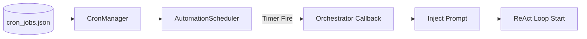

# Stuart Architecture: Deep Dive & Logic Flows

This document provides a granular technical examination of Stuart's core execution engine, focusing on the state machines and interaction loops that power the agent's reasoning.

## 🔄 1. The ReAct Execution Loop
The `AgentOrchestrator` implements a modified ReAct (Reason + Act) loop. Unlike basic LLM chains, Stuart's loop includes high-fidelity interception for safety and observability.

### ASCII Flowchart (Terminal View)
```text
+-----------------------+      +---------------------------+
|  User Prompt/Trigger  |----->|  Agent Orchestrator (B)   |
+-----------------------+      +-------------+-------------+
                                             |
                                +------------V------------+
                                | Analyze Intent/Context  |
                                +------------+------------+
                                             |
                                +------------V------------+
                                | Generate Thought/Action |
                                +------------+------------+
                                             |
                      +----------------------+----------------------+
                      | (Action Type?)                              |
             +--------V-------+                            +--------V-------+
             |   Tool Call    |                            | Final Answer   |
             +--------+-------+                            +--------+-------+
                      |                                             |
             +--------V-------+                            +--------V-------+
             | Approval System|                            | Send to User   |
             +--------+-------+                            +----------------+
                      |
             +--------V-------+      +------------------+      +------------------+
             | Token Minting  |----->|  Tool Executor   |----->|  Observation     |
             +----------------+      +------------------+      +--------+---------+
                                                                        |
                                                                        +-----+
                                                                              |
                                        (Loop Back to B) <--------------------+
```

### Granular Execution Phases
1.  **Intent Classification**: The LLM determines if the request requires tool usage or is a direct conversational response.
2.  **State Loading**: The `AgentRuntime` loads the previous execution snapshot from the SQL `runtime_state` table.
3.  **HIL Interception**: If the action has a risk level > `Moderate`, the loop **pauses** using a thread-safe signaling mechanism (`threading.Event`).
4.  **Observation Feedback**: Tool outputs are sanitized, scanned for DLP violations, and formatted into Markdown for the next reasoning step.

## 📑 2. Human-In-The-Loop (HIL) Signaling
The HIL system bridges the gap between the asynchronous background reasoning thread and the synchronous GUI overlay.

### ASCII Sequence Diagram
```text
Agent Thread        ApprovalSystem        WebSocket API        HIL GUI
     |                     |                    |                 |
     |--request_approval-->|                    |                 |
     |                     |--emit(APPROVAL)--->|                 |
     |      (BLOCKS)       |                    |------Show------>|
     |                     |                    |                 |
     |                     |                    |<---Update-------|
     |                     |                    |                 |
     |                     |<--set_response-----|                 |
     |--return Status----->|                    |                 |
     |                     |                    |                 |
```

## 📅 3. Proactive Scheduling Flow
Cron jobs are executed outside the primary user conversation loop but feed back into the same Orchestrator for consistency.



## 🧠 4. Cognitive Maintenance Loop
To prevent "model dementia" from high context volume, Stuart performs automated memory compression.

### The Distillation Algorithm:
1.  **Query**: Select all `interaction_history` nodes where `created_at < now - 7 days`.
2.  **Batching**: Group nodes by session or topic.
3.  **Compression**: A cheap, fast LLM (Ollama/Gemini-Flash) summarizes the raw logs into "Dense Fact Nodes".
4.  **Commit**: Save the dense summary to `system_distilled` category.
5.  **Prune**: `DELETE` the raw high-volume chatter from the SQLite database.

---

> [!IMPORTANT]
> All core loops are integrated with the **Observability System**. Every node in these diagrams generates a nested **OTEL Span** and inherits the parent **Trace ID**.
