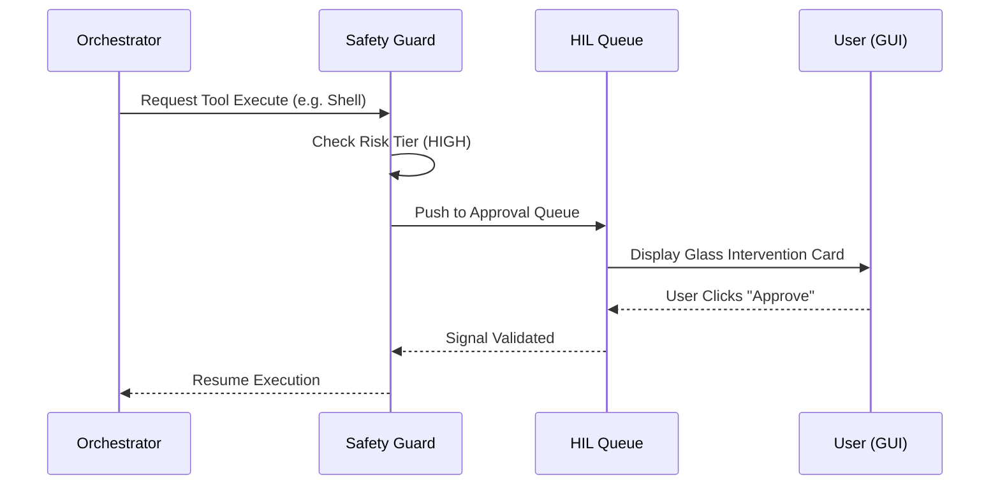

# Stuart HIL Control Panel
## Cognitive Terminal Design & Safety Interception

The Human-In-The-Loop (HIL) Control Panel is a premium, glassmorphic interface designed for real-time autonomy tuning, risk threshold management, and approval queue monitoring. It serves as the **Physical Intercept Layer** between the Agent Orchestrator and the user's system.

## Approval Lifecycle Sequence

## 🛡️ The Interception Logic

Stuart's safety architecture intercepts tool calls before they are executed. Depending on the current **Autonomy Level** and **Risk Thresholds**, a call may be automatically allowed, blocked, or sent to the GUI queue for manual approval.

### Autonomy Tier Mapping
| Level | Aesthetic | Behavior |
| :--- | :--- | :--- |
| **RESTRICTED** | `Red Orbit` | Pause & request approval for **every** action. |
| **MODERATE** | `Cyan Ambient` | Auto-allow Low/Med; Prompt on High/Critical. |
| **FULL** | `Ghost Stealth` | Maximum trust. All tasks auto-executed. |

## 🖥️ Cognitive Terminal Aesthetic

The HIL Panel has been redesigned to achieve pixel-perfect consistency with the **"Cognitive Terminal"** design system.

### Design Tokens & Hierarchy
- **Surfaces**: Using `--surface-container` (Charcoal #201f1f) with glassmorphic overlays.
- **Glassmorphism**: Unified tokens for `--glass-light` and `--glass-border` with a `blur(12px)` base.
- **Radii**: Standardized `var(--radius-md)` (6px) for technical sharpness.
- **No-Line Rule**: Borders are replaced by tonal contrast and glow effects to ensure a premium, floating instrument feel.

## 🏗️ Architecture

The HIL system is implemented in `core/approval_system.py` and integrated via `web/js/hil-panel.js`.

### Key Components
1. **Approval Engine**: Monitors `ApprovalRequest` objects in the orchestrator.
2. **WebSocket Signaling**: Pushes real-time alerts to the GUI via the `hil_event` channel.
3. **Thread Suspension**: Uses a `threading.Event` to pause the reasoning loop without blocking the main event sub-system.

---

> [!IMPORTANT]
> **Stealth Mode Warning**: 
> When `DEV_MODE` is disabled in `window_manager.py`, the HIL Panel remains invisible to screen-capture tools to prevent sensitive credentials from being leaked during recordings.

> [!TIP]
> Use the Hotkey `Alt+H` to quickly toggle the HIL Panel visibility if it is obstructed by another window in focus mode.
