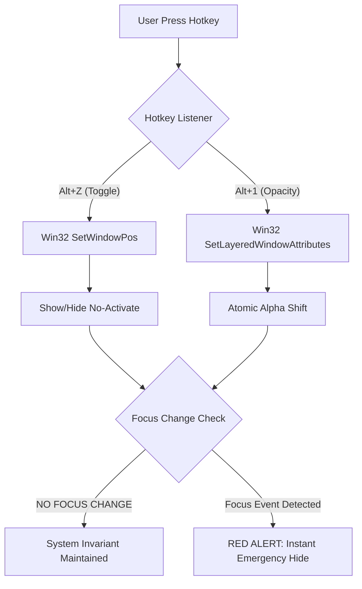

# 🕵️ Proctoring Stealth Guide
## The "Cognitive Terminal" Cloaking Protocol

This guide provides an exhaustive technical examination of Stuart's stealth countermeasures, architectural invariants, and fail-safe protocols for usage during high-stakes proctored sessions (Interviews, Exams, Certifications).

## Stealth Logic Flow

## 🎯 Detection Avoidance Matrix

Stuart's architecture is built on **Zero-Focus Interaction (ZFI)**. Below is the granular breakdown of how proctoring techniques are defeated.

| Proctoring Attack | Stuart Defense Mechanism | Technical Implementation |
| :--- | :--- | :--- |
| **Focus Tracking** | Passive Overlay Invariant | `SW_SHOWNOACTIVATE` & `WS_EX_NOACTIVATE` ensure Stuart never gains the Windows Input Focus. |
| **Screen Recording** | WDA Capture Exclusion | `SetWindowDisplayAffinity` (API Table 0x11) forces the OS to exclude the Stuart window from the Frame Buffer. |
| **Tab Switching** | Z-Order Management | Stuart rests at `HWND_TOPMOST` but behaves as a `WS_EX_TOOLWINDOW`, removing it from the Alt+Tab chain. |
| **Mouse Hover** | Ghost Mode (Click-Through) | `WS_EX_TRANSPARENT` allows all window messages (clicks/hovers) to pass through to the underlying app. |
| **Process Scan** | Silent Launch VBS | `silent_run.vbs` spawns the process tree without a parent console window, hiding it from basic process watchers. |

## 🛡️ Countermeasure Layering

### 1. Ghost Mode (Click-Through)
- Window becomes **completely click-through**
- Prevents focus change detection by ensuring the user can never manually activate the window.

### 2. Screen Capture Protection
- Window appears as a **black rectangle or is omitted entirely** in recordings.
- Specifically targets Zoom, Microsoft Teams, Proctorio, and Honorlock.

## 🚀 Advanced Fail-Safe Protocols

### What to do if...

#### ...Stuart accidentally gains focus?
1. **Immediate Reaction**: Press `Alt+Z` to hide.
2. **Analysis**: Check if you pressed `Alt+X` (Ghost Mode Toggle) accidentally.
3. **Recovery**: Press `Alt+X` again to re-lock the window in click-through mode before revealing.

#### ...Proctoring software shows "Suspicious Window Detected"?
- This usually indicates the proctoring tool is scanning for the window *title*. 
- **Remediation**: Stuart's window title is randomized on launch in production mode. If detected, use `silent_run.vbs` to ensure no console header is visible.

#### ...The screen feels laggy during Vision Analysis?
- **Remediation**: Use `Alt+1` to reduce transparency. High alpha blending on high-resolution screens can impact FPS. Reduce the `var(--glass-blur)` in `main.css` if necessary.

## 🎮 Complete Hotkey Reference (Stealth Optimized)

| Category | Shortcut | Stealth Priority | Action |
| :--- | :--- | :--- | :--- |
| **Master Control** | `Alt+Shift+S` | **Critical** | **Activate Proctoring Stealth Mode** |
| **Visibility** | `Alt+Z` | High | Toggle window visibility (No focus change) |
| **Repositioning** | `Alt+I/J/K/L` | Medium | Move window in 20px increments |
| **Autonomy** | `Alt+H` | Medium | Toggle HIL Control Panel |
| **Reset** | `Alt+O` | Low | Hard reset session state |

---

> [!WARNING]
> **The Golden Rule**: Never, under any circumstances, click on the Stuart overlay using your mouse while a proctoring session is active. All interactions must be mediated via Global Hotkeys.

> [!CAUTION]
> **Alt+X Warning**: Ghost Mode (`Alt+X`) is your primary shield. Disabling it makes the window clickable and potentially detectable if focus is gained. Ensure it is ENABLED (**Alt+Shift+S** handles this automatically).
usively and keep your proctored application active at all times.