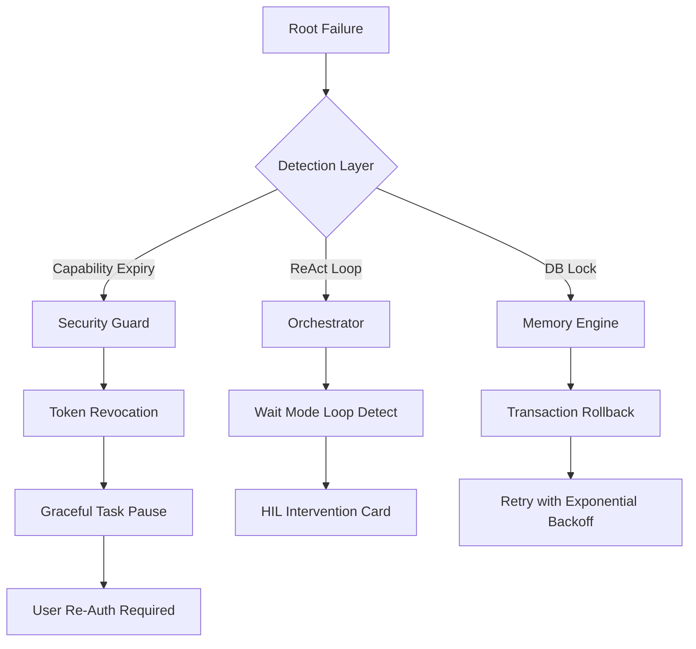

# Stuart Troubleshooting & Failure Matrix
## Technical Propagation & Recovery Protocols

This document provides a granular examination of potential failure modes across Stuart's architectural layers, including detection signatures, propagation paths, and remediation steps.

## Fail-Safe Propagation Flow

## 🛡️ 1. Security & Safety Layers

### `CapabilityTokenSystem`
| Failure Mode | Detection | Propagation Path | Critical Remediation |
| :--- | :--- | :--- | :--- |
| **Mid-call Expiry** | Tool execution fails with `403 Invalid Token` mid-stream. | Security Guard -> Tool Executor -> Task Pause | Increase `SESSION_TIMEOUT_BUFFER` in `security_config.json`. |
| **Token Hijack Attempt** | `SecurityAlert` triggered in logs; thread termination. | Watchdog -> Process Killer -> Log Redaction | Rotate `MANAGEMENT_KEY` immediately; system reboot. |
| **Resource Mismatch** | Valid token but "Access Denied" for specific path. | Guard -> Normalize Path -> ACL Check | Check `capability_pinning` rules in the Orchestrator. |

## 🧠 2. Cognitive & Memory Engine

### `CognitiveMaintenanceEngine`
| Failure Mode | Detection | Propagation Path | Critical Remediation |
| :--- | :--- | :--- | :--- |
| **Insight Hallucination** | Wrong "distilled" facts in Long-term memory. | Vector DB -> Maintenance Engine -> User View | Update prompt to "Veracity Priority" in `cognitive_config.py`. |
| **SQLite DB Lock** | `Database is locked` error during GC. | Connection Pool -> Commit Queue -> Timeout | Enable `PRAGMA journal_mode=WAL;` for concurrency. |

## 🔄 3. Orchestration & Loops

### `Orchestrator`
| Failure Mode | Detection | Propagation Path | Critical Remediation |
| :--- | :--- | :--- | :--- |
| **Infinite ReAct Loop** | Repeat tool calls with identical parameters. | LLM Logic -> Tool Dispatch -> State Match | Trigger `LoopCircuitBreaker`; reduce `MAX_REASONING_STEPS`. |
| **HIL Disconnect** | Approval required but GUI doesn't show card. | WebSocket -> JS Handler -> Panel View | Restart `hil_panel.js` sub-thread; verify WS heartbeats. |

## 🖥️ 4. Visual & Interface (GUI)

### `Ethereal Grid` Unified System
| Failure Mode | Detection | Propagation Path | Critical Remediation |
| :--- | :--- | :--- | :--- |
| **Token Fragmentation** | UI components showing mixed color schemes. | CSS Loader -> Root Variables -> Component | Check `main.css` for `--pure-black` vs hardcoded `rgba`. |
| **Glass Blurring Issues** | Heavy lag on dashboard interactions. | Backdrop Filter -> Layout Reflow -> GPU Lag | Reduce `blur(px)` value to `var(--glass-blur-sm)`. |

---

> [!IMPORTANT]
> **Graceful Degradation Protocol**: 
> If a critical failure is detected (e.g., capability loss), Stuart is programmed to enter **Safe Mode**. In this mode, tool execution is suspended but the Reasoning Stream remains active to explain the failure to the user.

> [!TIP]
> Always check the **Observability Logs** (`logs/stuart_runtime.log`) for the specific **Trace ID** associated with the failure. Most granular errors are logged at the `DEBUG` level.
